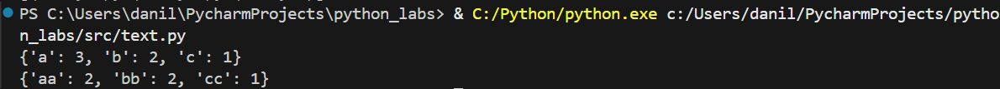
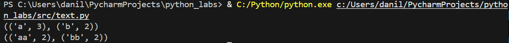
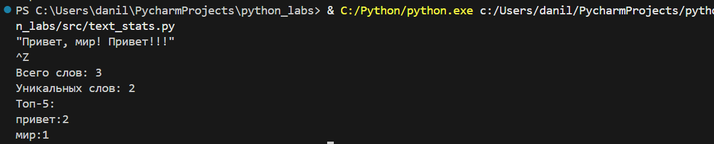
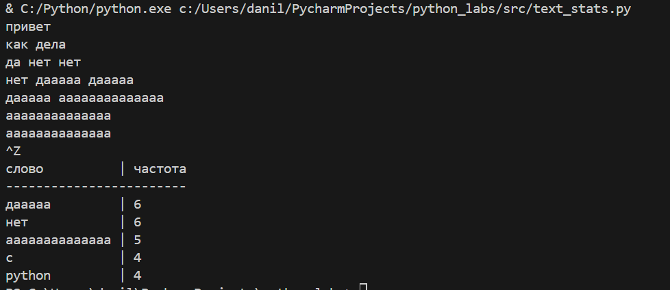

# ЛР3
## Задание A
```Python
def normalize(text: str, *, casefold: bool = True, yo2e: bool = True) -> str:
    if casefold:
        text = text.casefold()
    if yo2e:
        text = text.replace('Ё', 'Е').replace('ё', 'е')
    for i in ['\t', '\r', '\n', '\f', '\v']:
        text = text.replace(i, ' ')
    while '  ' in text:
        text = text.replace('  ', ' ')
    return text.strip()
```


```Python
def tokenize(text: str) -> list[str]:
    lst = []
    current_word = []
    i = 0
    while i < len(text):
        c = text[i]
        if c.isalnum() or c == '_':
            current_word.append(c)
        elif c == '-':
            if current_word and i + 1 < len(text) and (text[i + 1].isalnum() or text[i + 1] == '_'):
                current_word.append(c)
            else:
                if current_word:
                    lst.append(''.join(current_word))
                    current_word = []
        else:
            if current_word:
                lst.append(''.join(current_word))
                current_word = []
        i += 1
    if current_word:
        lst.append(''.join(current_word))
    return lst
```


```Python
def count_freq(tokens: list[str]) -> dict[str, int]:
    d = {}
    for word in tokens:
        if word not in d:
            d[word] = 1
        else:
            d[word] += 1
    return dict(sorted(d.items()))
```



```Python
def top_n(freq: dict[str, int], n: int = 5) -> list[tuple[str, int]]:
    sorted_counts = sorted(freq.items(), key=lambda item: item[1], reverse=True)
    return sorted_counts[:n]
```



# Задание B

```Python
from text import tokenize, top_n, count_freq
import sys


def main():
    text = sys.stdin.read()
    words = tokenize(text.lower())
    freq = count_freq(words)

    print(f"Всего слов: {len(words)}")
    print(f"Уникальных слов: {len(freq)}")
    print("Топ-5:")

    for word, count in top_n(freq, 5):
        print(f"{word}:{count}")


if __name__ == "__main__":
    main()
```



## Задание со *

```Python
from text import tokenize, top_n, count_freq
import sys


def main():
    text = sys.stdin.read()
    words = tokenize(text.lower())
    freq = count_freq(words)

    max_width = max(len(word) for word, _ in top_n(freq, 5))
    print(f"{'слово'.ljust(max_width)} | частота")
    print('-' * (max_width + 10))
    for word, count in top_n(freq, 5):
        print(f"{word.ljust(max_width)} | {count}")

if __name__ == "__main__":
    main()
```

