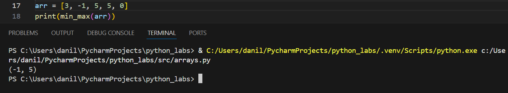
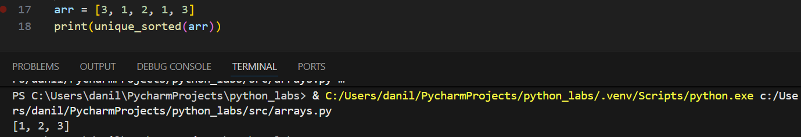
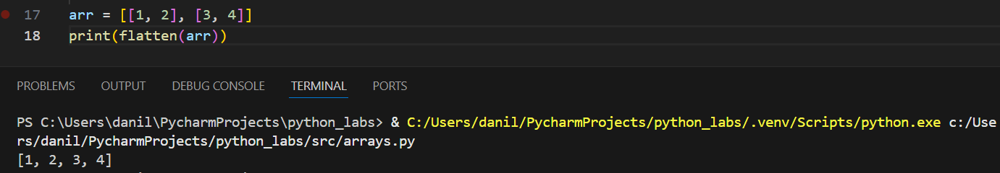
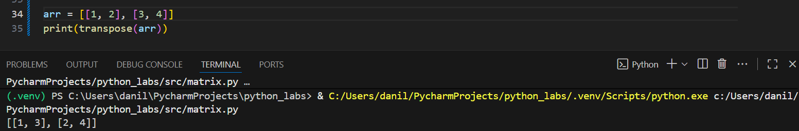
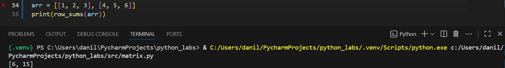
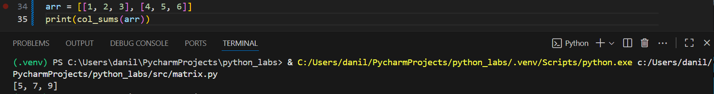
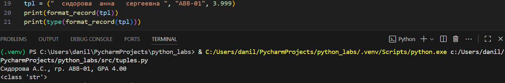

# ЛР2

#### Задание 1

```Python
def min_max(arr):
    if len(arr) == 0:
        return 'ValueError'
    else:
        return (min(arr), max(arr))

def unique_sorted(arr):
    return tuple(set(sorted(arr)))

def flatten(arr):
    lst = []
    for i in arr:
        for j in i: 
            if isinstance(j, int) or isinstance(j, float):
                lst.append(j)
            else:
                return 'TypeError'
    return lst
```





#### Задание 2 / B

```Python
def transpose(mat):
    if len(mat) == 0 or mat == [[]]:
        return []
    for i in mat:
        if len(i) != len(mat[0]):
            return 'ValueError'
    lst = []
    for i in range(len(mat[0])):
        new_row = []
        for j in mat:
            new_row.append(j[i])
        lst.append(new_row)
    return lst

def row_sums(mat):
    for i in mat:
        if len(i) != len(mat[0]):
            return 'ValueError'
    lst = []
    for i in mat:
        lst.append(sum(i))
    return lst

def col_sums(mat):
    for i in mat:
        if len(i) != len(mat[0]):
            return 'ValueError'
    lst = [0] * len(mat[0])
    for i in mat:
        for j in range(len(mat[0])):
            lst[j] += i[j]          
    return lst
```





#### Задание 3 / C

```Python
def format_record(rec):
    fio, group, gpa = rec
    if not isinstance(fio, str) or not fio.strip():
        return 'Пустое или нестроковое ФИО'
    if not isinstance(group, str) or not group.strip():
        return 'Пустая или нестроковая группа'
    if not isinstance(gpa, (float, int)):
        return 'GPA должен быть числом'
    
    parts = fio.strip().split()
    parts = [part for part in parts if part]
    if len(parts) < 2:
        return 'ФИО должно содержать хотя бы фамилию и имя'
    LastName = parts[0].capitalize()
    initials = ""
    for i in range(1, min(3, len(parts))):
        initials += parts[i][0].upper() + '.'
    return f'{LastName} {initials}, гр. {group}, GPA {round(float(gpa), 2):.2f}'
tpl = ("  сидорова  анна   сергеевна ", "ABB-01", 3.999)
print(format_record(tpl))
print(type(format_record(tpl)))
```

