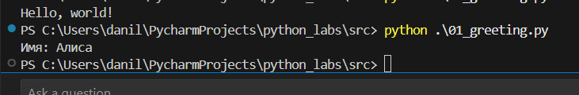
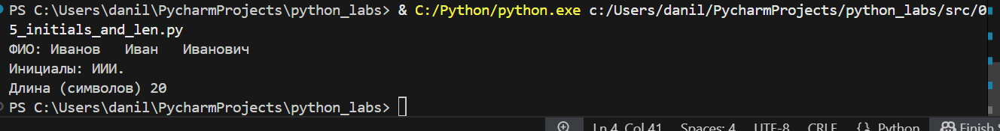

# ЛР1
#### Задание 1

``` Python
name = input('Имя: ')
age = int(input("Возраст: "))
print(f'Привет {name}! Через год тебе будет {age + 1}')
```


#### Задание 2

``` Python
a = float(input('a: '))
b = float(input('b: '))
print(f'sum={a+b}; avg={3.88}')
```



#### Задание 3

