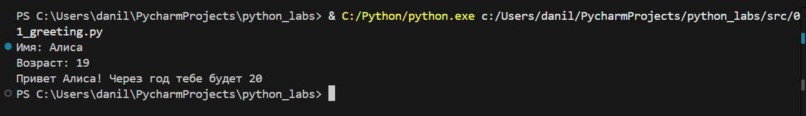
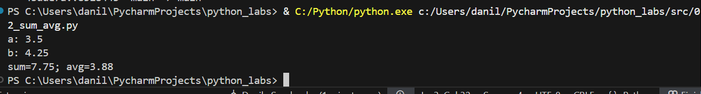
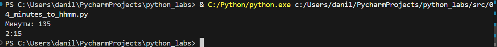
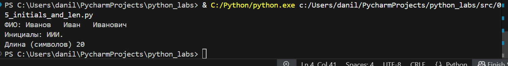
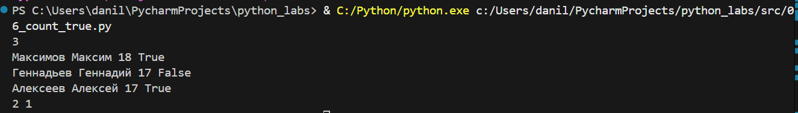
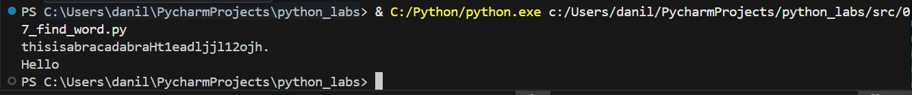

# ЛР1
#### Задание 1

``` Python
name = input('Имя: ')
age = int(input("Возраст: "))
print(f'Привет {name}! Через год тебе будет {age + 1}')
```


#### Задание 2

``` Python
a = float(input('a: '))
b = float(input('b: '))
print(f'sum={a+b:.2f}; avg={(a + b) / 2:.2f}')
```



#### Задание 3
```Python
price = float(input())
discount = float(input())
vat = float(input())
base = price * (1 - discount/100)
vat_amount = base * (vat/100)
total = base + vat_amount
print(f'База после скидки: {base}')
print(f'НДС: {vat_amount}')
print(f'Итого к оплате: {total}')
```

#### Задание 4
``` Python
m = int(input("Минуты: "))
print(f'{m//60}:{m % 60}')
```

####  Задание 5
``` Python
a = input('ФИО: ').strip()
print('Инициалы: ',''.join([i[0].upper() for i in a.split()]), '.',sep='')
print("Длина (символов)", len(a)-4)
```

#### Задание 6*
```Python
n = int(input())
full_time = 0
for i in range(n):
    full_information = input().split()
    if full_information[3] == 'True':
        full_time += 1
print(full_time, n-full_time)
```

####Задание 7*
```Python

line = input()
first_digit = 0
r = 0
while line:
    if line[r].isupper():
        first_digit = r
        break
    r += 1
second_digit = 0
while line:
    if line[r].isdigit():
        second_digit = r
        break
    r += 1
step = second_digit-first_digit
new_line = ''
for i in range(first_digit, line.index('.'), step + 1):
    new_line += line[i]
print(new_line)
```
