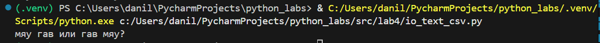

# Лр 4

## Задание А

```Python
from pathlib import Path


def read_text(path: str | Path, encoding: str = "utf-8") -> str:
    """encoding (str, по умолчанию "utf-8"): Кодировка файла.
            Если требуется открыть файл в другой кодировке, укажите ее явно,
            например: encoding='cp1251'"""
    with open(path, encoding=encoding) as file:
        return file.read()
```



```Python
from pathlib import Path
import csv

def write_csv(rows: list[tuple | list], path: str | Path, header: tuple[str, ...] | None = None) -> None:
    if not rows:
        return 
    
    length = len(rows[0])
    for row in rows:
        if len(row) != length:
            raise ValueError

    with open(path, mode='w', newline='', encoding='utf-8') as file:
        writer = csv.writer(file, delimiter=',', quoting=csv.QUOTE_MINIMAL)
        if header:
            writer.writerow(header)
        writer.writerows(rows)
```


## Задание B

```Python
from pathlib import Path
import sys
sys.path.append('src/lab3')
import csv

from text import tokenize, top_n, normalize, count_freq


def main():
    input_path = Path("data/input.txt")
    output_path = Path("data/report.csv")

    with open(input_path, encoding="utf-8") as f:
        text = f.read()

    normalized_text = normalize(text)
    words = tokenize(normalized_text)
    freq = count_freq(words)

    sorted_freq = sorted(freq.items(), key=lambda x: (-x[1], x[0]))

    with open(output_path, "w", encoding="utf-8", newline="") as f:
        writer = csv.writer(f, delimiter=",")
        writer.writerow(["word", "count"])
        writer.writerows(sorted_freq)

    print(f"Всего слов: {len(words)}")
    print(f"Уникальных слов: {len(freq)}")
    print("Топ-5:")
    for word, count in top_n(freq, 5):
        print(f"{word}:{count}")

if __name__ == "__main__":
    main()
```

### Тест-кейсы

#### A


#### B


#### C


