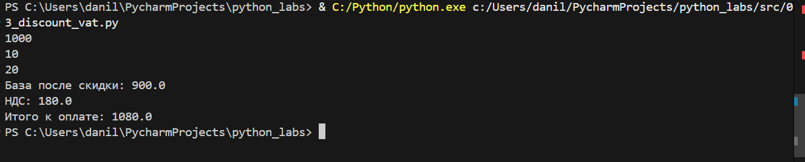

# ЛР1
#### Задание 1

``` Python
name = input('Имя: ')
age = int(input("Возраст: "))
print(f'Привет {name}! Через год тебе будет {age + 1}')
```


#### Задание 2

``` Python
a = float(input('a: '))
b = float(input('b: '))
print(f'sum={a+b}; avg={3.88}')
```


#### Задание 3
```Python
price = float(input())
discount = float(input())
vat = float(input())
base = price * (1 - discount/100)
vat_amount = base * (vat/100)
total = base + vat_amount
print(f'База после скидки: {base}')
print(f'НДС: {vat_amount}')
print(f'Итого к оплате: {total}')
```

#### Задание 4
``` Python
m = int(input("Минуты: "))
print(f'{m//60}:{m % 60}')
```

####  Задание 5
``` Python
a = input('ФИО: ').strip()
print('Инициалы: ',''.join([i[0].upper() for i in a.split()]), '.',sep='')
print("Длина (символов)", len(a)-4)
```
